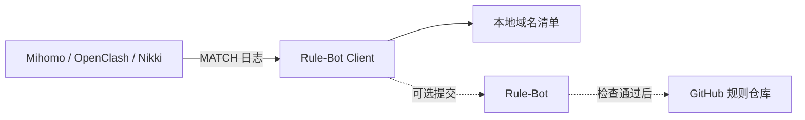

# Rule-Bot Client

Rule-Bot Client 用来收集 Mihomo 最终落入 `MATCH` 规则的域名。收集结果可以只保存在本地，也可以交给 [Rule-Bot](https://github.com/Aethersailor/Rule-Bot) 判断是否需要补充直连规则。

[下载最新版本](https://github.com/Aethersailor/Rule-Bot-Client/releases/latest) · [用户 Wiki](https://github.com/Aethersailor/Rule-Bot-Client/wiki)

## 它适合解决什么问题

- 找出当前规则没有覆盖、最终交给 `MATCH` 处理的域名。
- 将结果整理成去重后的本地域名清单，便于查看和后续处理。
- 可选接入 Rule-Bot，由服务端继续检查规则、GeoSite 和域名策略，再决定是否写入 GitHub 规则仓库。
- 在 OpenWrt 上通过 LuCI 管理 OpenClash、Nikki 或手工添加的 Mihomo 外部控制器（Controller）。

Rule-Bot Client 不是代理客户端，也不会修改 Mihomo 配置。它不记录 URL 路径、查询参数、网页内容或应用名称，也不能代替完整的流量审计工具。

## 工作方式



Rule-Bot 投递默认关闭。仅本地收集时，域名不会发送给 Rule-Bot。

## 开始前需要确认

- 已有正在运行的 Mihomo、OpenClash 或 Nikki。
- Mihomo Controller 可由 Rule-Bot Client 访问；如设置了控制器密钥，需要准备该密钥。
- Mihomo 日志级别为 `info` 或更详细。过滤掉相关日志后，客户端无法还原已经结束的连接。
- 已确认有权收集设备或网络中的域名数据。共享网络尤其需要先了解下方的隐私边界。

Rule-Bot 不是本地收集的前置条件。建议先完成本地收集和连接测试，再决定是否接入 Rule-Bot。

## 选择安装方式

| 使用环境 | 推荐方式 | 说明 |
| --- | --- | --- |
| OpenWrt 24.10 或 25.12 | LuCI 单包 | 支持 `x86_64`、`aarch64_generic`、`mips_24kc` 和 `mipsel_24kc`，安装后使用 Web 界面配置 |
| Debian 或 Ubuntu | `.deb` 软件包 | 支持 `amd64`、`arm64` 和 `armhf`，使用 systemd 运行 |
| 其他 Linux | Docker Compose | 镜像支持 `linux/amd64` 和 `linux/arm64`，无需映射端口 |
| 不使用 Docker 的 Linux | 原生二进制 | Releases 提供 AMD64、386、ARM、MIPS、MIPS64、RISC-V 等构建 |

当前没有 Windows 或 macOS 正式构建。OpenWrt 必须使用专用的 IPK 或 APK 单包，不要安装通用 Linux 压缩包。

### OpenWrt 快速安装

> [!WARNING]
> OpenWrt 软件包安装后会启用服务并尝试启动，默认自动发现 OpenClash 并使用「仅本地收集」。Rule-Bot 默认关闭，不会自动外发。运行安装命令前，应先确认允许在这台路由器上收集域名。

在 OpenWrt SSH 终端中下载正式 Release 提供的统一安装脚本。脚本会识别包管理器、系统版本和架构，并在安装前校验软件包大小与 SHA-256：

```sh
wget -O /tmp/install-rule-bot-client-openwrt.sh \
  https://github.com/Aethersailor/Rule-Bot-Client/releases/latest/download/install-rule-bot-client-openwrt.sh
cat /tmp/install-rule-bot-client-openwrt.sh
sh /tmp/install-rule-bot-client-openwrt.sh
```

安装完成后，打开「服务 → Rule-Bot Client」。连接 Controller、选择工作模式和验证结果的步骤见 [OpenWrt 使用指南](https://github.com/Aethersailor/Rule-Bot-Client/wiki/OpenWrt-%E4%BD%BF%E7%94%A8%E6%8C%87%E5%8D%97)。

### Linux 与 Docker

Debian 软件包、Docker Compose 和原生二进制的完整步骤见 [Linux 与 Docker](https://github.com/Aethersailor/Rule-Bot-Client/wiki/Linux-%E4%B8%8E-Docker)。Linux 版本没有 Web 界面，使用 JSON 配置文件，并通过日志和输出文件确认状态。

## 怎样确认已经正常工作

安装完成只是第一步。按下面的顺序检查，可以快速判断问题出在哪一层：

| 检查层级 | 确认方式 |
| --- | --- |
| 服务 | OpenWrt「概览」显示正在运行，或 systemd、Docker 显示进程正在运行 |
| Mihomo 连接 | OpenWrt「测试连接」成功或实例显示已连接；Linux 日志出现 `instance=... connected` |
| 本地收集 | 产生一个此前未收集、实际命中 `MATCH` 的有效域名后，「本地结果」或输出文件出现新行 |
| Rule-Bot 处理 | 启用后，日志出现已添加、已存在、GeoSite 已覆盖或策略拒绝等明确终态 |

本地输出默认每 5 秒刷新一次。`--check` 只检查 JSON、凭据和 TLS 文件是否有效，不会连接 Mihomo；配置检查通过，不等于 Controller 已经连通。

## 隐私与使用边界

> [!CAUTION]
> 域名清单可能反映个人、家庭或组织网络的访问行为。本地输出不会自动过期。成功添加的域名会进入目标仓库的提交历史；目标仓库公开时，域名也会公开。之后吊销 Token 或关闭客户端无法撤回已有提交。

- 本地域名清单每行只包含一个域名，不为每个域名记录访问次数或时间戳；运行日志和可选状态文件仍会包含运维时间与计数。
- 默认也会收集最终落入 `MATCH` 的失败连接域名；不需要时可在配置中关闭。
- OpenWrt 和随附示例默认使用可注册域名模式，减少完整子域带来的识别风险。
- 实时日志流没有持久化队列。断线期间已经结束的短连接可能无法补回，因此本项目不提供审计级的零丢失保证。
- 使用公网 Rule-Bot 入口时必须使用 HTTPS；Token、Controller 密钥和完整配置不要发布到 Issue、聊天记录或公开仓库。

启用 Rule-Bot 前，请阅读完整的 [客户端隐私说明](PRIVACY.md) 和对应服务方的隐私说明。

## 可选接入 Rule-Bot

本地收集正常后，可以在配置中填写 Rule-Bot 服务方提供的完整入口和 Token：

- 私用入口由 Rule-Bot 部署者提供。
- 社区用户需要私聊对应的 Rule-Bot，进入「Rule-Bot Client 接入」，阅读并同意隐私说明，通过群成员验证后领取个人 Token。
- 群聊只用于社区资格验证。客户端不会读取群消息，也不会把提交结果发送到群内。
- 首次启用且没有状态文件时，`send_existing=false` 会从当前文件末尾开始；已有状态文件时，重新启用会从原游标继续。

具体字段见 Wiki 的[配置说明](https://github.com/Aethersailor/Rule-Bot-Client/wiki/%E9%85%8D%E7%BD%AE%E8%AF%B4%E6%98%8E)。自行部署 Rule-Bot 时，另见 [Rule-Bot Client 接入说明](https://github.com/Aethersailor/Rule-Bot/wiki/Rule-Bot-Client-%E6%8E%A5%E5%85%A5)。

## 用户文档

| 文档 | 内容 |
| --- | --- |
| [OpenWrt 使用指南](https://github.com/Aethersailor/Rule-Bot-Client/wiki/OpenWrt-%E4%BD%BF%E7%94%A8%E6%8C%87%E5%8D%97) | 安装、首次配置、升级、备份和卸载 |
| [Linux 与 Docker](https://github.com/Aethersailor/Rule-Bot-Client/wiki/Linux-%E4%B8%8E-Docker) | Debian、Docker Compose、原生二进制和日常管理 |
| [配置说明](https://github.com/Aethersailor/Rule-Bot-Client/wiki/%E9%85%8D%E7%BD%AE%E8%AF%B4%E6%98%8E) | Controller、域名模式、Rule-Bot、TLS 和代理设置 |
| [故障排查](https://github.com/Aethersailor/Rule-Bot-Client/wiki/%E6%95%85%E9%9A%9C%E6%8E%92%E6%9F%A5) | 无法连接、没有结果、投递失败和安全地收集诊断信息 |
| [隐私说明](PRIVACY.md) | 本地保存、外发数据、出口 IP 和用户控制 |
| [安全策略](SECURITY.md) | 私密报告安全问题，以及公开反馈前需要移除的信息 |

## 反馈与许可

使用问题或功能建议可以提交到 [GitHub Issues](https://github.com/Aethersailor/Rule-Bot-Client/issues)。公开反馈前，请移除 Token、Controller 密钥、私有地址和真实域名清单。

本项目采用 [GNU General Public License v3.0](LICENSE)。
